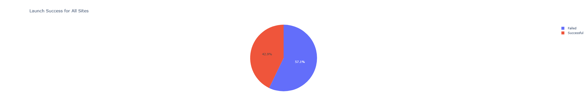
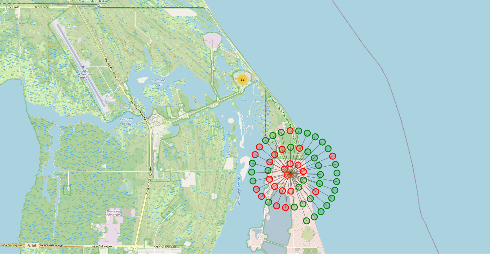
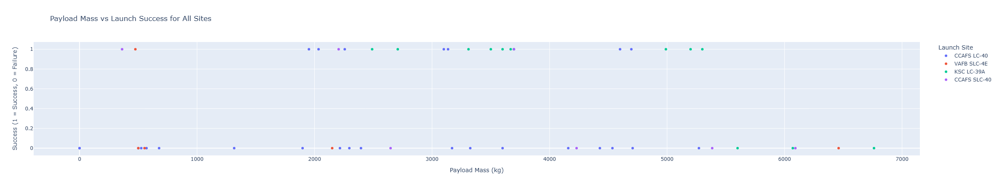
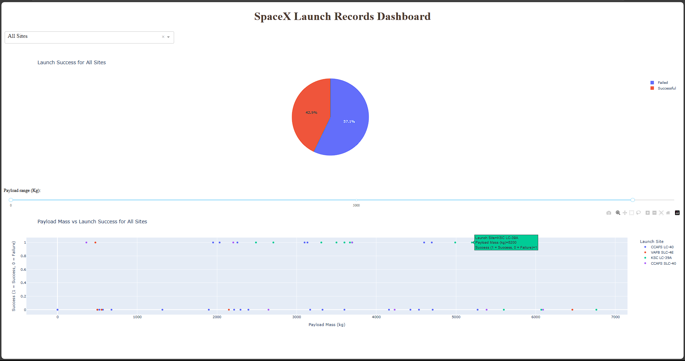
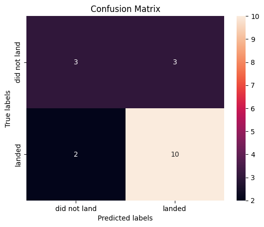
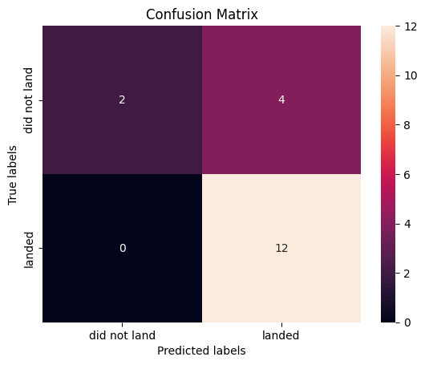

# SpaceX Rocket Landing Intelligence Project Description

SpaceX Rocket Landing Intelligence leverages machine learning algorithms to predict the success of rocket landings, a key factor in improving the reusability of rockets and reducing the overall cost of space missions. By analyzing historical launch data from SpaceX, the project builds and evaluates several classification models to forecast whether a rocket landing will be successful or fail.

The project uses multiple machine learning algorithms including Logistic Regression, Support Vector Machines (SVM), Decision Trees, and K-Nearest Neighbors (KNN) to predict landing outcomes based on various factors such as the rocket’s specifications, launch site, and weather conditions.

###Fetching and Analyzing SpaceX Launch Data

This task focuses on extracting data from the **SpaceX API**, cleaning the dataset, and analyzing key insights. The data is fetched using the endpoint `https://api.spacexdata.com/v4/launches/past` and then converted into a **Pandas DataFrame** for further exploration and manipulation.

#### Steps:
1. **Fetching Data from SpaceX API**:  
   The endpoint `https://api.spacexdata.com/v4/launches/past` is used to retrieve historical launch data from SpaceX. The data is returned in JSON format and is subsequently converted into a Pandas DataFrame.

2. **Data Cleaning and Exploration**:  
   After loading the data, it is cleaned by handling missing or irrelevant information. The dataset is then explored to identify patterns, such as factors influencing landing success, including weather conditions, rocket specifications, and launch site data.

###Extracting Column Names from Wikipedia Table (Web Scraping)

This task demonstrates the process of **web scraping** to extract the column names from an HTML table on the Wikipedia page listing Falcon 9 and Falcon Heavy launches. In this task, the **requests** library is used to fetch the page content, and **BeautifulSoup** is utilized to parse the HTML and extract the data.

**Web scraping** is a technique used to automatically extract data from websites. In this case, it is applied to retrieve the table column headers from the Wikipedia page that lists SpaceX's Falcon 9 and Falcon Heavy launches.

#### Steps:
1. **Fetching Data from Wikipedia**:  
   The URL for the Wikipedia page containing the list of Falcon 9 and Falcon Heavy launches is:  
   [https://en.wikipedia.org/w/index.php?title=List_of_Falcon_9_and_Falcon_Heavy_launches&oldid=1027686922](https://en.wikipedia.org/w/index.php?title=List_of_Falcon_9_and_Falcon_Heavy_launches&oldid=1027686922)  

   This page contains a table with columns describing various attributes of each launch, such as the launch date, mission type, and the rocket's specifications.

2. **Parsing HTML Table with BeautifulSoup**:
   The HTML content of the page is fetched and parsed using **BeautifulSoup**. The table headers (column names) are then extracted from the HTML and printed.

### Interactive Map and Dashboard for Launch Site Analysis

This section of the project focuses on visualizing SpaceX launch data using interactive maps and dashboards. Key features include analyzing the proximity of launch sites and building interactive dashboards with **Pie Charts** and **Scatter Plots**.

#### 1. **Interactive Map to Analyze Launch Site Proximity (Folium)**

An interactive map is created using the **Folium** library to analyze the proximity of different SpaceX launch sites. The map provides a geographical representation of launch sites and helps visualize their locations relative to each other.

#### 2. **Interactive Dashboard with Plotly Dash**

An interactive dashboard is built using **Plotly Dash** to visualize SpaceX launch statistics. The dashboard includes pie charts and scatter plots to analyze the distribution of successful and failed launches, payload types, and other relevant metrics.

### Machine Learning Models for Rocket Landing Prediction

In this section, we compare the performance of different machine learning models to predict the success of SpaceX rocket landings. The models used are **Logistic Regression**, **SVM**, **Decision Tree**, and **K-Nearest Neighbors (KNN)**. Their performance is evaluated using key classification metrics such as accuracy, precision, recall, F1-score, and support.

#### Model Performance Metrics:

| Model            | Accuracy | Precision | Recall | F1-Score | Support |
|------------------|----------|-----------|--------|----------|---------|
| Logistic Regression | 0.833333 | 0.8       | 1.0    | 0.888889 | 0.75    |
| SVM               | 0.833333 | 0.8       | 1.0    | 0.888889 | 0.75    |
| Decision Tree     | 0.722222 | 0.769231  | 0.833333 | 0.8    | 0.666667 |
| KNN               | 0.777778 | 0.75      | 1.0    | 0.857143 | 0.666667 |

#### Model Confusion Matrices

The following images display the confusion matrices for each model:

| Logistic Regression | SVM | Decision Tree | KNN |
|---------------------|-----|---------------|-----|
|  |  |  |  |

   
