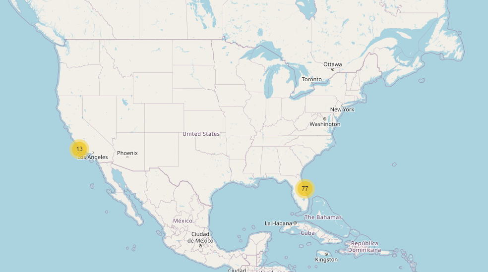

# SpaceX Rocket Landing Intelligence

**SpaceX Rocket Landing Intelligence** utilizes machine learning algorithms to predict the success of rocket landings, improving reusability and reducing the costs associated with space launches. This project employs various classification models to assess landing outcomes based on historical data from SpaceX missions.

## Project Overview

SpaceX aims to revolutionize space exploration with reusable rockets. By predicting the success of rocket landings, we can enhance the accuracy of reusability predictions and optimize the landing process. This project implements a variety of machine learning algorithms, such as Logistic Regression, SVM, Decision Trees, and K-Nearest Neighbors (KNN), to build a predictive model based on SpaceX's historical launch data.

### Classifier Performance

The models were trained on the dataset and evaluated on key performance metrics. Here’s a summary of their results:

- **Logistic Regression**
  - Accuracy: 83.33%
  - Precision: 80%
  - Recall: 100%
  - F1-Score: 88.89%
  
  

- **Support Vector Machine (SVM)**
  - Accuracy: 83.33%
  - Precision: 80%
  - Recall: 100%
  - F1-Score: 88.89%

  

- **Decision Tree**
  - Accuracy: 72.22%
  - Precision: 76.92%
  - Recall: 83.33%
  - F1-Score: 80%

  

- **K-Nearest Neighbors (KNN)**
  - Accuracy: 77.78%
  - Precision: 75%
  - Recall: 100%
  - F1-Score: 85.71%

  

## Features

This project involves several key tasks that demonstrate both data analysis and machine learning skills:

1. **Data Cleaning & Exploration**: 
   - Clean the dataset, handle missing values, and perform exploratory data analysis to uncover meaningful insights.
   
2. **Data Visualization**: 
   - Visualize the relationships between different features and outcomes using plots like scatter plots and bar charts.
   
3. **Machine Learning Models**: 
   - Train multiple classifiers to predict rocket landing success.
   - Evaluate and compare the models' performance using accuracy, precision, recall, and F1-score.

4. **Hyperparameter Tuning**: 
   - Use grid search to fine-tune the hyperparameters of the classifiers for optimal performance.

5. **Interactive Visualizations**:
   - **Launch Site Proximity Analysis**: Build an interactive map to explore the proximity of launch sites using the **Folium** library.
   
   
   
   - **Landing Success Visualization**: Generate a pie chart visualizing the percentage of successful and failed landings.

   

6. **Interactive Dashboard**:
   - Create a dynamic dashboard using **Plotly Dash** that includes interactive charts like pie charts and scatter plots for better data exploration.
   
   

## Data Analysis & Machine Learning Workflow

The project follows a structured approach:

1. **Exploratory Data Analysis (EDA)**: 
   - Load and explore the dataset using Python’s Pandas and Matplotlib libraries to understand its structure and extract insights.
   
2. **Feature Engineering**: 
   - Perform data transformations and create new features to improve model performance.

3. **Model Training**: 
   - Split the data into training and testing sets and train the selected machine learning models.
   
4. **Model Evaluation**: 
   - Evaluate the models based on various performance metrics (accuracy, precision, recall, and F1-score).
   
5. **Visualization & Reporting**: 
   - Present the findings with visually appealing charts and diagrams, providing insights into model performance.

## Visualizations

Here are some of the key visualizations generated during the analysis:

- **Launch Site Proximity**: An interactive map that shows the location of SpaceX launch sites and their proximity to other locations.
  
  

- **Pie Chart of Success vs. Failure**: A pie chart that visualizes the distribution of successful and failed rocket landings.

  

- **Confusion Matrices**: Visual representations of the models' performance, which show the true positives, true negatives, false positives, and false negatives for each classifier.

  - Logistic Regression Confusion Matrix:
    
  
  - SVM Confusion Matrix:
    

  - Decision Tree Confusion Matrix:
    

  - KNN Confusion Matrix:
    

## Conclusion

This project illustrates the application of data science and machine learning techniques to solve real-world problems in space exploration. By predicting the success of rocket landings, this model can help SpaceX optimize its launch and landing processes, ultimately reducing costs and increasing the reusability of rockets.

## Files and Images

### Directory Structure:

